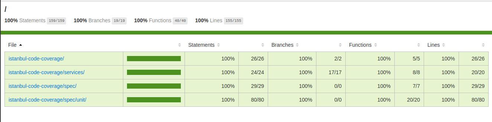

# istanbul-code-coverage
Example project for istanbul jasmine and supertest integration

## Installation
```text
npm install
```

## Getting Started
After installation, open cmd and cd to that folder.

Run the service:
```sh
>> npm run start
```

Run the unit test:
```sh
>> npm run test
```

Run the istanbul code coverage:
```sh
>> npm run test-cover
```

Watch code coverage report:
```text
cd ./coverage/lcov-report
index.html
```

# ISTANBUL CODE COVERAGE
## Report 

